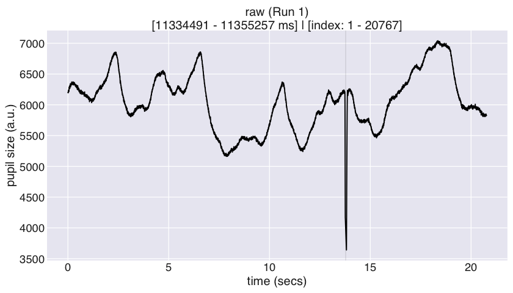
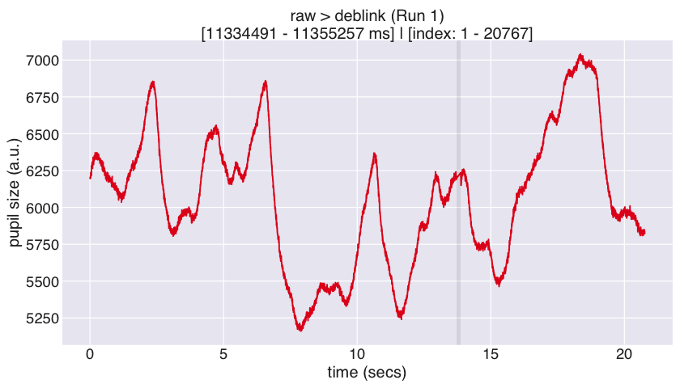
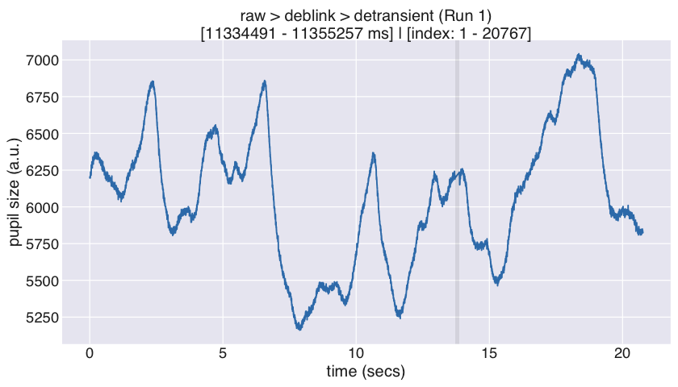
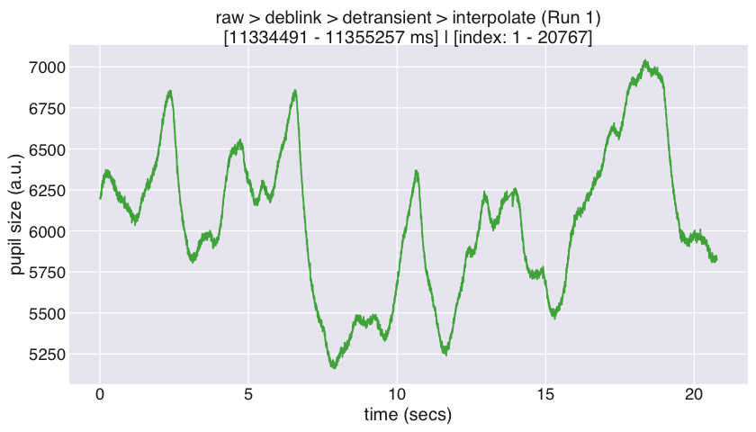
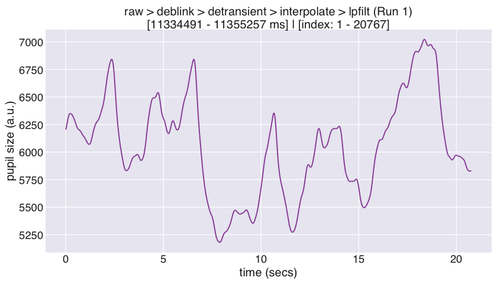
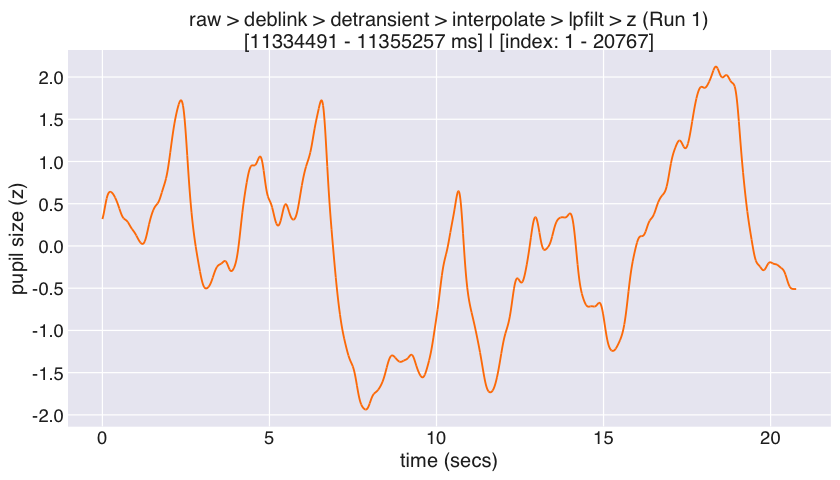
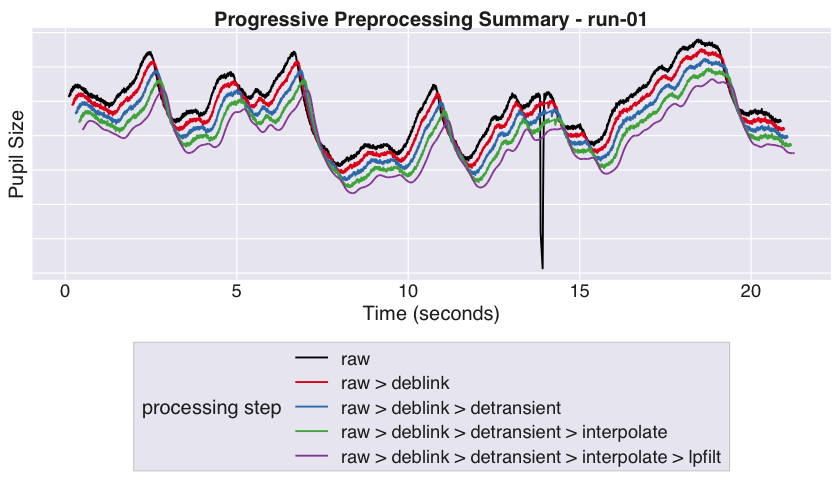
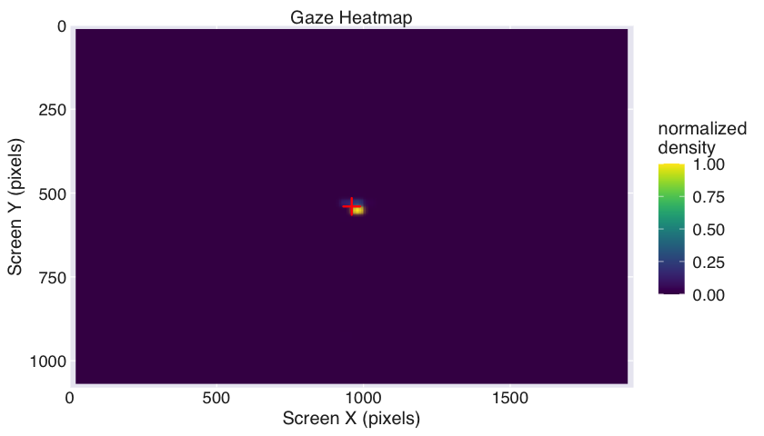
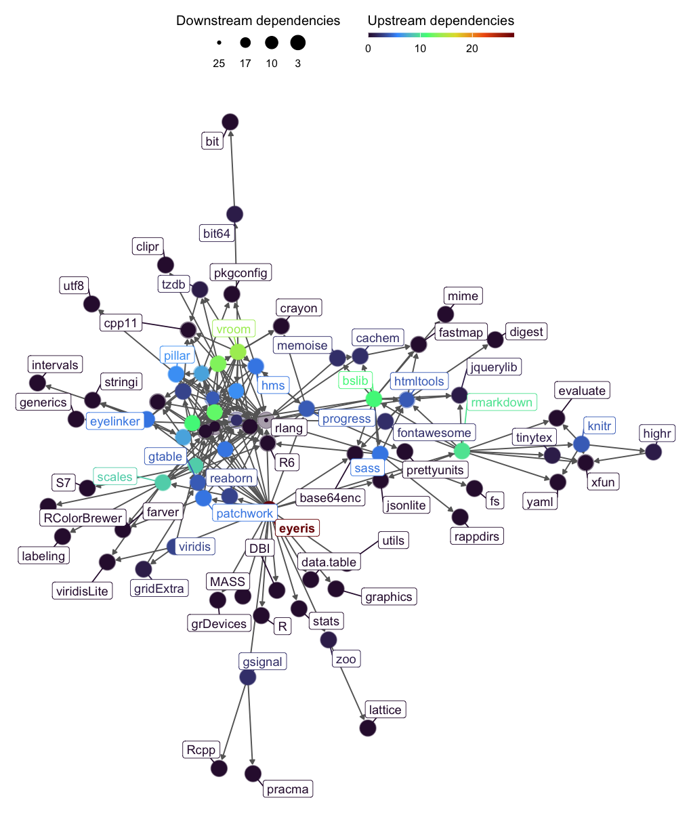

<!-- README.md is generated from README.Rmd-->

# `eyeris`: Flexible, Extensible, & Reproducible Pupillometry Preprocessing <a href="https://eyeris.shawnschwartz.com/" title="eyeris website"></a>

<!-- badges: start -->

[](https://github.com/shawntz/eyeris/tree/dev)
[](https://CRAN.R-project.org/package=eyeris)
[](https://cran.r-project.org/package=badger)
[](https://doi.org/10.1101/2025.06.01.657312)
[](https://lifecycle.r-lib.org/articles/stages.html#stable)
[](https://github.com/shawntz/eyeris/actions/workflows/build.yml)
[](https://github.com/shawntz/eyeris/actions/workflows/air-format-check.yml)
[](https://github.com/shawntz/eyeris/actions/workflows/air-format-suggest.yml)
[](https://github.com/shawntz/eyeris/actions/workflows/spellcheck.yml)
[](https://github.com/shawntz/eyeris/actions/workflows/pkgdown.yml)
<!-- badges: end -->

<div class="alert alert-light">

<h2>

💻 eyeris DevOps Dashboard
</h2>

Dive deeper into <code>eyeris’</code> development and operational
insights with our new
<a href="https://shawnschwartz.notion.site/eyeris-devops" target="_blank">eyeris
DevOps Dashboard</a>!

</div>

<!-- The goal of eyeris is to ... -->

## 💡 Motivation

Despite decades of pupillometry research, many established packages and
workflows unfortunately lack design principles based on (F)indability
(A)ccessbility (I)nteroperability (R)eusability (FAIR) principles.
`eyeris`, on the other hand follows a thoughtful design philosophy that
results in an intuitive, modular, performant, and extensible
pupillometry data preprocessing framework. Much of these design
principles were heavily inspired by `Nipype`.

`eyeris` also provides a highly opinionated pipeline for tonic and
phasic pupillometry preprocessing (inspired by `fMRIPrep`). These
opinions are the product of many hours of discussions from core members
and signal processing experts from the Stanford Memory Lab (Shawn
Schwartz, Mingjian He, Haopei Yang, Alice Xue, and Anthony Wagner).

`eyeris` also introduces a `BIDS`-like structure for organizing
derivative (preprocessed) pupillometry data, as well as an intuitive
workflow for inspecting preprocessed pupillometry epochs within
beautiful, interactive HTML report files (see demonstration below ⬇)!
The package also includes gaze heatmaps that show the distribution of
eye coordinates across the entire screen area, helping you assess data
quality and participant attention patterns. These heatmaps are
automatically generated in the BIDS reports and can also be created
manually.

<div class="alert alert-light">

### 👁 Supported eye-tracker formats

The current version of `eyeris` reads data recorded with **SR Research
EyeLink** eye-trackers (via the `.asc` files produced by the EyeLink
`edf2asc` converter). EyeLink remains the most widely used
research-grade system in the pupillometry community, so we focused our
initial efforts there to ensure a robust, well-tested foundation.

That said, `eyeris` is designed from the ground up to be
**format-agnostic downstream of data loading**: every preprocessing step
operates on a standardized internal `eyeris` object rather than on raw
EyeLink files. This means support for additional open-source and vendor
eye-tracker formats (e.g., Pupil Labs, Tobii, GazePoint, and the
emerging [BIDS Eye Tracking](https://bids.neuroimaging.io/)
specification) can be added by writing a new data-loading function that
maps raw samples and event messages onto the same internal
representation — no changes to the preprocessing pipeline are required.

**Roadmap & community contributions.** Broadening native support for
other tracker formats is on our roadmap, and we actively welcome
community contributions of new loaders. If you would like to help add
support for your tracker of choice, please open an issue or pull
request — see the [contribution
guidelines](https://eyeris.shawnschwartz.com/CONTRIBUTING.html) to get
started.

</div>

## 🚀 Feature Highlights

- `📦 Modular Design`: Each preprocessing step is a standalone function
  that can be used independently or combined into custom pipelines.
- `🔍 Interactive Reports`: Beautiful, interactive HTML reports that
  summarize preprocessing steps and visualize data quality.
- `🔄 Flexible Extensions`: Easily create custom extensions to the
  preprocessing pipeline by writing your own functions and adding them
  to the pipeline.
- `📊 Data Quality Assessment`: Automatically generated figures of each
  preprocessing step and its effect on the pupil signal (at the global
  and trial levels), as well as gaze heatmaps and binocular correlation
  plots to assess data quality and participant attention patterns.
- `🗂️ BIDS-like File Structure`: Organizes preprocessed data using a
  BIDS-like directory structure that supports both monocular and
  binocular eye-tracking data.
- `📝 Logging Commands`: Automatically capture all console output and
  errors to timestamped log files.


## 📖 Function Reference

Below is a table of all main `eyeris` functions, organized by feature,
with links to their documentation and a brief description.

| **Feature** | **Function Documentation** | **Description** |
|----|----|----|
| **Pipeline Orchestration** | [glassbox()](https://eyeris.shawnschwartz.com/reference/glassbox.html) | Run the full recommended preprocessing pipeline with a single function call. |
| **BIDSify** | [bidsify()](https://eyeris.shawnschwartz.com/reference/bidsify.html) | Create a BIDS-like directory structure for preprocessed data as well as interactive HTML reports for data and signal processing provenance. |
| **Data Loading** | [load_asc()](https://eyeris.shawnschwartz.com/reference/load_asc.html) | Load EyeLink `.asc` files into an `eyeris` object. |
| **Sampling-Grid Resampling** | [resample()](https://eyeris.shawnschwartz.com/reference/resample.html) | Place each block onto the expected uniform sampling grid, repairing dropped-sample gaps for hardware that drops (rather than zero-fills) missing pupil data. |
| **Blink Artifact Removal** | [deblink()](https://eyeris.shawnschwartz.com/reference/deblink.html) | Remove blink artifacts by extending and masking missing samples. |
| **Transient (Speed-Based) Artifact Removal** | [detransient()](https://eyeris.shawnschwartz.com/reference/detransient.html) | Remove transient spikes in the pupil signal using a moving MAD filter. |
| **Linear Interpolation** | [interpolate()](https://eyeris.shawnschwartz.com/reference/interpolate.html) | Interpolate missing (NA) samples in the pupil signal. |
| **Lowpass Filtering** | [lpfilt()](https://eyeris.shawnschwartz.com/reference/lpfilt.html) | Apply a Butterworth lowpass filter to the pupil signal. |
| **Downsampling** | [downsample()](https://eyeris.shawnschwartz.com/reference/downsample.html) | Downsample the pupil signal to a lower sampling rate. |
| **Binning** | [bin()](https://eyeris.shawnschwartz.com/reference/bin.html) | Bin pupil data into specified time bins using mean or median. |
| **Detrending** | [detrend()](https://eyeris.shawnschwartz.com/reference/detrend.html) | Remove slow drifts from the pupil signal by linear detrending. |
| **Z-scoring** | [zscore()](https://eyeris.shawnschwartz.com/reference/zscore.html) | Z-score the pupil signal within each block. |
| **Confound Summary** | [summarize_confounds()](https://eyeris.shawnschwartz.com/reference/summarize_confounds.html) | Summarize and visualize confounding variables for each preprocessing step. |
| **Epoching & Baselining** | [epoch()](https://eyeris.shawnschwartz.com/reference/epoch.html) | Extract time-locked epochs from the continuous pupil signal. |
| **Plotting** | [plot()](https://eyeris.shawnschwartz.com/reference/plot.eyeris.html) | Plot the pupil signal and preprocessing steps. |
| **Gaze Heatmaps** | [plot_gaze_heatmap()](https://eyeris.shawnschwartz.com/reference/plot_gaze_heatmap.html) | Generate heatmaps of gaze position across the screen. |
| **Binocular Correlation** | [plot_binocular_correlation()](https://eyeris.shawnschwartz.com/reference/plot_binocular_correlation.html) | Compute correlation between left and right eye pupil signals. |
| **Demo (Monocular) Dataset** | [eyelink_asc_demo_dataset()](https://eyeris.shawnschwartz.com/reference/eyelink_asc_demo_dataset.html) | Load a demo monocular recording EyeLink dataset for testing and examples. |
| **Demo (Binocular) Dataset** | [eyelink_asc_binocular_demo_dataset()](https://eyeris.shawnschwartz.com/reference/eyelink_asc_binocular_demo_dataset.html) | Load a demo binocular recording EyeLink dataset for testing and examples. |
| **Logging Commands** | [eyelogger()](https://eyeris.shawnschwartz.com/reference/eyelogger.html) | Automatically capture all console output and errors to timestamped log files. |
| **Database Storage** | [eyeris_db_collect()](https://eyeris.shawnschwartz.com/reference/eyeris_db_collect.html) | High-performance database storage and querying alternative to CSV files. |
| **Database Summary** | [eyeris_db_summary()](https://eyeris.shawnschwartz.com/reference/eyeris_db_summary.html) | Get comprehensive overview of database contents and metadata. |
| **Database Connection** | [eyeris_db_connect()](https://eyeris.shawnschwartz.com/reference/eyeris_db_connect.html) | Connect to eyeris databases for custom queries and operations. |
| **Database Export (Chunked)** | [eyeris_db_to_chunked_files()](https://eyeris.shawnschwartz.com/reference/eyeris_db_to_chunked_files.html) | Export large databases in configurable chunks with automatic file size limits. |
| **Database Export (Parquet)** | [eyeris_db_to_parquet()](https://eyeris.shawnschwartz.com/reference/eyeris_db_to_parquet.html) | Export database to high-performance Parquet format files. |
| **Read Parquet Files** | [read_eyeris_parquet()](https://eyeris.shawnschwartz.com/reference/read_eyeris_parquet.html) | Read and combine eyeris Parquet files with schema-aligned binding. |
| **Database Sharing (Split)** | [eyeris_db_split_for_sharing()](https://eyeris.shawnschwartz.com/reference/eyeris_db_split_for_sharing.html) | Split databases into chunks for easier sharing and collaboration. |
| **Database Sharing (Reconstruct)** | [eyeris_db_reconstruct_from_chunks()](https://eyeris.shawnschwartz.com/reference/eyeris_db_reconstruct_from_chunks.html) | Reconstruct complete databases from shared chunks. |
| **Custom Extensions** | *See vignette: [Custom Extensions](https://eyeris.shawnschwartz.com/articles/custom-extensions.html)* | Learn how to write your own pipeline steps and integrate them with `eyeris`. |
| **Internal API Reference** | *See vignette: [Internal API Reference](https://eyeris.shawnschwartz.com/articles/internal-api.html)* | Comprehensive documentation of all internal functions for advanced users and developers. |

> For a full list of all functions, see the [eyeris reference
> index](https://eyeris.shawnschwartz.com/reference/index.html).

## 📚 Tutorials

### 🌟 Start Here

- [✈ Getting Started: Complete (Opinionated) Pupillometry Pipeline
  Walkthrough](https://eyeris.shawnschwartz.com/articles/complete-pipeline.html)
- [📁 Extracting Data Epochs and Exporting Pupil
  Data](https://eyeris.shawnschwartz.com/articles/epoching-bids-reports.html)

### 👀 Pupil Data Quality Control

- [🔎 QC with Interactive
  Reports](https://eyeris.shawnschwartz.com/articles/reports.html)

### 💯 Advanced Topics

- [🫀 Anatomy of an `eyeris`
  Object](https://eyeris.shawnschwartz.com/articles/anatomy.html)
- [🛠 Building Your Own Custom Pipeline
  Extensions](https://eyeris.shawnschwartz.com/articles/custom-extensions.html)
- [🗄 Database Storage Guide: Scalable Alternative to CSV
  Files](https://eyeris.shawnschwartz.com/articles/database-guide.html)

## 📦 Package Installation

### Stable release from CRAN

You can install the stable release of [`eyeris` from
CRAN](https://cran.r-project.org/package=eyeris) with:

``` r
install.packages("eyeris")
```

or

``` r
# install.packages("pak")
pak::pak("eyeris")
```

### Development version from GitHub

You can install the development version of [`eyeris` from
GitHub](https://github.com/shawntz/eyeris) with:

``` r
# install.packages("devtools")
devtools::install_github("shawntz/eyeris", ref = "dev")
```

### Optional: Database and Parquet Support

`eyeris` offers optional high-performance database storage (via
`DuckDB`) and parquet file I/O (via `Arrow`) as alternatives to CSV
files. These packages are **not required** for core functionality but
provide significant performance benefits for large-scale analyses.

#### Installing DuckDB (for database features)

The `duckdb` package enables efficient storage and querying of large
datasets. Required for `bidsify(..., db_enabled = TRUE)` and all
`eyeris_db_*` functions:

``` r
install.packages("duckdb")
```

**Platform-specific notes:**

- **macOS**: `install.packages("duckdb", type = "binary")`
- **Linux**: Use system packages (e.g.,
  `sudo apt-get install r-cran-duckdb`) or install from CRAN
- **Windows**: `install.packages("duckdb")`

#### Installing Arrow (for faster parquet operations)

The `arrow` package provides high-performance parquet file I/O for
functions like `eyeris_db_to_parquet()`, `read_eyeris_parquet()`, and
related export/import operations. When not available, `eyeris`
automatically falls back to DuckDB for parquet operations (slower but
functional).

**macOS users:** Arrow requires system dependencies via Homebrew:

``` bash
# Install system dependencies first
brew update
brew install pkg-config cmake apache-arrow

# Then install the R package
```

``` r
install.packages("arrow", type = "binary")
```

**Linux users (Ubuntu/Debian):**

``` bash
# Install system dependencies
sudo apt-get update
sudo apt-get install -y libcurl4-openssl-dev libssl-dev
```

``` r
install.packages("arrow")
```

**Linux users (Fedora/RHEL):**

``` bash
# Install system dependencies
sudo dnf install libcurl-devel openssl-devel
```

``` r
install.packages("arrow")
```

**Windows users:**

``` r
install.packages("arrow")
```

For more details, see the [Arrow R
documentation](https://arrow.apache.org/docs/r/).

> **Note:** When you load `eyeris`, startup messages will inform you if
> DuckDB or Arrow are not installed and provide detailed
> platform-specific installation instructions. You can also access these
> instructions anytime via `?check_duckdb` and `?check_arrow`. Once
> installed, restart R and reload `eyeris` to enable these features.

### System Requirements

**Minimum requirements:**

- R \>= 4.1.0
- 8 GB RAM for basic preprocessing

**Recommended for large datasets:**

- 16 GB RAM or more when generating HTML reports with `bidsify()`,
  especially for datasets with many epochs or long recordings
- SSD storage for improved I/O performance with database operations

> **Note:** HTML report generation uses `pandoc` internally via
> `rmarkdown`. Large preprocessing pipelines with many epochs may
> require additional memory during report rendering.

## ✏ Example

### The `glassbox()` “prescription” function

This is a basic example of how to use `eyeris` out of the box with our
very *opinionated* set of steps and parameters that one should start out
with when preprocessing pupillometry data. Critically, this is a
“glassbox” – as opposed to a “blackbox” – since each step and parameter
implemented herein is fully open and accessible to you. We designed each
pipeline step / function to be like a LEGO brick – they are
intentionally and carefully designed in a way that allows you to
flexibly construct and compare different pipelines.

We hope you enjoy! -Shawn

``` r
set.seed(32)

library(eyeris)
#> 
#> eyeris v3.2.0.9000 - Lumpy Space Princess ꒰•ᴗ•｡꒱۶
#> Welcome! Type ?`eyeris` to get started.

demo_data <- eyelink_asc_demo_dataset()

eyeris_preproc <- glassbox(
  demo_data,
  lpfilt = list(plot_freqz = FALSE)
)
#> ✔ [2026-07-02 20:14:27] [OKAY] Running eyeris::load_asc()
#> ✔ [2026-07-02 20:14:28] [OKAY] Running eyeris::resample()
#> ℹ [2026-07-02 20:14:28] [INFO] Processing block: block_1
#> ✔ [2026-07-02 20:14:28] [OKAY] Running eyeris::deblink() for block_1
#> ✔ [2026-07-02 20:14:28] [OKAY] Running eyeris::detransient() for block_1
#> ✔ [2026-07-02 20:14:28] [OKAY] Running eyeris::interpolate() for block_1
#> ✔ [2026-07-02 20:14:28] [OKAY] Running eyeris::lpfilt() for block_1
#> ! [2026-07-02 20:14:28] [WARN] Skipping eyeris::downsample() for block_1
#> ! [2026-07-02 20:14:28] [WARN] Skipping eyeris::bin() for block_1
#> ! [2026-07-02 20:14:28] [WARN] Skipping eyeris::detrend() for block_1
#> ✔ [2026-07-02 20:14:28] [OKAY] Running eyeris::zscore() for block_1
#> ℹ [2026-07-02 20:14:28] [INFO] Block processing summary:
#> ℹ [2026-07-02 20:14:28] [INFO] block_1: OK (steps: 6, latest:
#> pupil_raw_deblink_detransient_interpolate_lpfilt_z)
#> ✔ [2026-07-02 20:14:28] [OKAY] Running eyeris::summarize_confounds()
```

### Step-wise correction of pupillary signal

``` r
plot(eyeris_preproc, add_progressive_summary = TRUE)
```

<div style="display: flex; justify-content: center; gap: 20px;">


</div>

### Final pre-post correction of pupillary signal (raw ➡ preprocessed)

``` r
start_time <- min(eyeris_preproc$timeseries$block_1$time_secs)
end_time <- max(eyeris_preproc$timeseries$block_1$time_secs)

plot(eyeris_preproc,
  # steps = c(1, 5), # uncomment to specify a subset of preprocessing steps to plot; by default, all steps will plot in the order in which they were executed by eyeris
  preview_window = c(start_time, end_time),
  add_progressive_summary = TRUE
)
#> ℹ [2026-07-02 20:14:28] [INFO] Plotting block 1 with sampling rate 1000 Hz from
#> possible blocks: 1
```



    #> ℹ [2026-07-02 20:14:28] [INFO] Creating progressive summary plot for block_1



    #> ✔ [2026-07-02 20:14:29] [OKAY] Progressive summary plot created successfully!

    plot_gaze_heatmap(
      eyeris = eyeris_preproc,
      block = 1
    )



## 🗄 Database Storage: Scalable Alternative to CSV Files

`eyeris` includes powerful database functionality powered by `DuckDB`
that provides a scalable, efficient alternative to CSV file storage.
This is especially valuable for large studies, cloud computing, and
collaborative research projects.

### Why Use Databases?

**🚀 Performance at Scale** - Handle hundreds of subjects efficiently
vs. managing thousands of CSV files - Faster queries: filter and
aggregate at the database level instead of loading all data into `R` -
Reduced memory usage: load only the data you need

**💯 Cloud Computing Optimized** - Reduce I/O costs on AWS, GCP, Azure -
Single database file vs. thousands of CSV files for data transfer -
Bandwidth efficient and cost-effective for large datasets

**🔒 Data Integrity** - Built-in schema validation prevents data
corruption - Automatic metadata tracking and timestamps

### Quick Start: `eyeris` Project Database Creation

Enable `eyeris` project database storage alongside or instead of CSV
files:

``` r
bidsify(
  processed_data,
  bids_dir = "~/my_study",
  participant_id = "001",
  session_num = "01", 
  task_name = "memory_task",
  csv_enabled = TRUE,    # keep traditional BIDS-style CSV output files
  db_enabled = TRUE,     # but also create an eyeris project database
  db_path = "study_database"
)

bidsify(
  processed_data,
  bids_dir = "~/my_study",
  participant_id = "001", 
  session_num = "01",
  task_name = "memory_task", 
  csv_enabled = FALSE,   # skip CSV creation
  db_enabled = TRUE,     # cloud-optimized: Database only (no CSV files)
  db_path = "study_database"
)
```

### Simple Data Extraction

Extract all your data with one function call:

``` r
# extract ALL data for ALL subjects
all_data <- eyeris_db_collect("~/my_study", "study_database")

# access specific data types
timeseries_data <- all_data$timeseries
confounds_data <- all_data$run_confounds

# targeted extraction: specific subjects and data types
subset_data <- eyeris_db_collect(
  "~/my_study", 
  "study_database",
  subjects = c("001", "002", "003"),
  data_types = c("timeseries", "epochs", "confounds_summary")
)
```

### Database Overview and Management

``` r
# get a comprehensive database summary
summary <- eyeris_db_summary("~/my_study", "study_database")
summary$subjects      # all subjects in database
summary$data_types    # available data types  
summary$total_tables  # number of tables

# connect to eyeris database for custom operations
con <- eyeris_db_connect("~/my_study", "study_database")
# ... custom SQL queries ...
eyeris_db_disconnect(con)
```

> **💡 Pro Tip**: Use `csv_enabled = FALSE, db_enabled = TRUE` for cloud
> computing to maximize efficiency and minimize costs.

> **📖 Complete Guide**: See the [Database Storage
> Guide](https://eyeris.shawnschwartz.com/articles/database-guide.html)
> for comprehensive tutorials, advanced usage, and real-world examples.

## 📁 BIDS-like file structure

`eyeris` organizes preprocessed data using a BIDS-like directory
structure that supports both monocular and binocular eye-tracking data.
The `bidsify()` function creates a standardized directory hierarchy with
separate organization for different data types.

### Monocular data structure

For single-eye recordings, data are organized in the main eye directory:

    bids_dir/
    └── derivatives/
        └── sub-001/
            └── ses-01/
                ├── sub-001_task-test.html
                └── eye/
                    ├── sub-001_ses-01_task-test_run-01_desc-timeseries.csv
                    ├── sub-001_ses-01_task-test_run-01_desc-confounds.csv
                    ├── sub-001_ses-01_task-test_run-01_desc-preproc_pupil_epoch-stimulus_bline-sub-stimulus.csv
                    ├── sub-001_ses-01_task-test_run-01_events.csv
                    ├── sub-001_ses-01_task-test_run-01_blinks.csv
                    ├── sub-001_ses-01_task-test_run-01_summary.csv
                    ├── sub-001_ses-01_task-test_run-01.html
                    └── source/
                        ├── figures/
                        │   └── task-test_run-01/
                        │       ├── task-test_run-01_fig-1_deblink.jpg
                        │       ├── task-test_run-01_fig-2_detrend.jpg
                        │       ├── task-test_run-01_fig-3_interpolate.jpg
                        │       ├── task-test_run-01_fig-4_lpfilt.jpg
                        │       ├── task-test_run-01_fig-5_zscore.jpg
                        │       ├── task-test_run-01_gaze_heatmap.png
                        │       ├── task-test_run-01_detrend.png
                        │       └── task-test_run-01_desc-progressive_summary.png
                        └── logs/
                            └── task-test_run-01_metadata.json

### Binocular data structure

For binocular recordings, data are organized into separate `left` and
`right` eye subdirectories:

    bids_dir/
    └── derivatives/
        └── sub-001/
            └── ses-01/
                ├── sub-001_task-test_eye-L.html
                ├── sub-001_task-test_eye-R.html
                ├── eye-L/
                │   ├── sub-001_ses-01_task-test_run-01_desc-timeseries_eye-L.csv
                │   ├── sub-001_ses-01_task-test_run-01_desc-confounds_eye-L.csv
                │   ├── sub-001_ses-01_task-test_run-01_desc-preproc_pupil_epoch-stimulus_bline-sub-stimulus_eye-L.csv
                │   ├── sub-001_ses-01_task-test_run-01_events_eye-L.csv
                │   ├── sub-001_ses-01_task-test_run-01_blinks_eye-L.csv
                │   ├── sub-001_ses-01_task-test_run-01_summary_eye-L.csv
                │   ├── sub-001_ses-01_task-test_run-01_eye-L.html
                │   └── source/
                │       ├── figures/
                │       │   └── task-test_run-01/
                │       └── logs/
                │           └── task-test_run-01_metadata.json
                └── eye-R/
                    ├── sub-001_ses-01_task-test_run-01_desc-timeseries_eye-R.csv
                    ├── sub-001_ses-01_task-test_run-01_desc-confounds_eye-R.csv
                    ├── sub-001_ses-01_task-test_run-01_desc-preproc_pupil_epoch-stimulus_bline-sub-stimulus_eye-R.csv
                    ├── sub-001_ses-01_task-test_run-01_events_eye-R.csv
                    ├── sub-001_ses-01_task-test_run-01_blinks_eye-R.csv
                    ├── sub-001_ses-01_task-test_run-01_summary_eye-R.csv
                    ├── sub-001_ses-01_task-test_run-01_eye-R.html
                    └── source/
                        ├── figures/
                        │   └── task-test_run-01/
                        └── logs/
                            └── task-test_run-01_metadata.json

### File naming convention

All files follow a consistent BIDS-like naming pattern:

- **Timeseries data**: `desc-timeseries` (with `_eye-L` or `_eye-R`
  suffix for binocular data)
- **Confounds**: `desc-confounds` (with eye suffix for binocular data)
- **Epochs**: `desc-preproc_pupil_epoch-{event}` (with eye suffix for
  binocular data); when baseline correction is applied, the baseline is
  folded into the same file as a `_bline-{type}-{event}` token
  (e.g. `desc-preproc_pupil_epoch-{event}_bline-{type}-{event}`)
- **Events**: `events` (with eye suffix for binocular data)
- **Blinks**: `blinks` (with eye suffix for binocular data)
- **Reports**: HTML files with eye suffix for binocular data

### Events and blinks data

The events and blinks CSV files contain the raw event markers and blink
detection data as stored in the eyeris object:

**Events file structure:**

- `block`: Block/run number
- `time`: Timestamp of the event
- `text`: Raw event text from the ASC file
- `text_unique`: Unique event identifier

**Blinks file structure:**

- `block`: Block/run number
- `stime`: Start time of the blink
- `etime`: End time of the blink
- `dur`: Duration of the blink in milliseconds
- `eye`: Eye identifier (L/R for binocular data)

### Key features

- **Organized Structure**: Clear separation between monocular and
  binocular data
- **Consistent Naming**: Standardized file naming across all data types
- **Complete Documentation**: HTML reports with preprocessing summaries
  and visualizations
- **Quality Assessment**: Gaze heatmaps and binocular correlation plots
  for data quality evaluation
- **Reproducibility**: Metadata files documenting preprocessing
  parameters and call stacks

## 📝 Logging `eyeris` commands with `eyelogger()`

The `eyelogger()` utility lets you run any `eyeris` command (or block of
R code) while automatically capturing all console output and errors to
timestamped log files. This is especially useful for reproducibility,
debugging, or running batch jobs.

**How it works:**

- All standard output (`stdout`) and standard error (`stderr`) are saved
  to log files in a directory you specify (or a temporary directory by
  default).
- Each run produces two log files:
  - `<timestamp>.out`: all console output
  - `<timestamp>.err`: all warnings and errors

### Usage

You can wrap any `eyeris` command or block of code in
`eyelogger({ ... })`:

``` r
library(eyeris)

# log a simple code block with messages, warnings, and prints
eyelogger({
  message("eyeris `glassbox()` completed successfully.")
  warning("eyeris `glassbox()` completed with warnings.")
  print("some eyeris-related information.")
})

# log a real eyeris pipeline run, saving logs to a custom directory
log_dir <- file.path(tempdir(), "eyeris_logs")
eyelogger({
  glassbox(eyelink_asc_demo_dataset(), interactive_preview = FALSE)
}, log_dir = log_dir)
```

### Parameters

- `eyeris_cmd`: The code to run (wrap in `{}` for multiple lines).
- `log_dir`: Directory to save logs (default: a temporary directory).
- `timestamp_format`: Format for log file names (default:
  `"%Y%m%d_%H%M%S"`).

### What you get

After running, you’ll find log files in your specified directory, e.g.:

    20240614_153012.out   # console output
    20240614_153012.err   # warnings and errors

This makes it easy to keep a record of your preprocessing runs and debug
any issues that arise.

------------------------------------------------------------------------

## :see_no_evil: `eyeris` dependency graph



------------------------------------------------------------------------

## 🤝 Contributing to `eyeris`

Thank you for considering contributing to the open-source `eyeris` R
package; there are many ways one could contribute to `eyeris`.

We believe the best preprocessing practices emerge from collective
expertise and rigorous discussion. Please see the [contribution
guidelines](https://eyeris.shawnschwartz.com/CONTRIBUTING.html) for more
information on how to get started..

## 📜 Code of Conduct

Please note that the eyeris project is released with a [Contributor Code
of Conduct](https://eyeris.shawnschwartz.com/CODE_OF_CONDUCT.html). By
contributing to this project, you agree to abide by its terms.

## 💬 Suggestions, questions, issues?

Please use the issues tab (<https://github.com/shawntz/eyeris/issues>)
to make note of any bugs, comments, suggestions, feedback, etc… all are
welcomed and appreciated, thanks!

## 📚 Citing `eyeris`

<div class="alert alert-light" style="padding-bottom: 0;">

If you use the `eyeris` package in your research, please consider citing
our preprint!

Run the following in R to get the citation:

</div>

``` r
citation("eyeris")
#> To cite package 'eyeris' in publications use:
#> 
#>   Schwartz ST, Yang H, Xue AM, He M (2025). "eyeris: A flexible,
#>   extensible, and reproducible pupillometry preprocessing framework in
#>   R." _bioRxiv_, 1-37. doi:10.1101/2025.06.01.657312
#>   <https://doi.org/10.1101/2025.06.01.657312>.
#> 
#> A BibTeX entry for LaTeX users is
#> 
#>   @Article{,
#>     title = {eyeris: A flexible, extensible, and reproducible pupillometry preprocessing framework in R},
#>     author = {Shawn T Schwartz and Haopei Yang and Alice M Xue and Mingjian He},
#>     journal = {bioRxiv},
#>     year = {2025},
#>     pages = {1--37},
#>     doi = {10.1101/2025.06.01.657312},
#>   }
```
