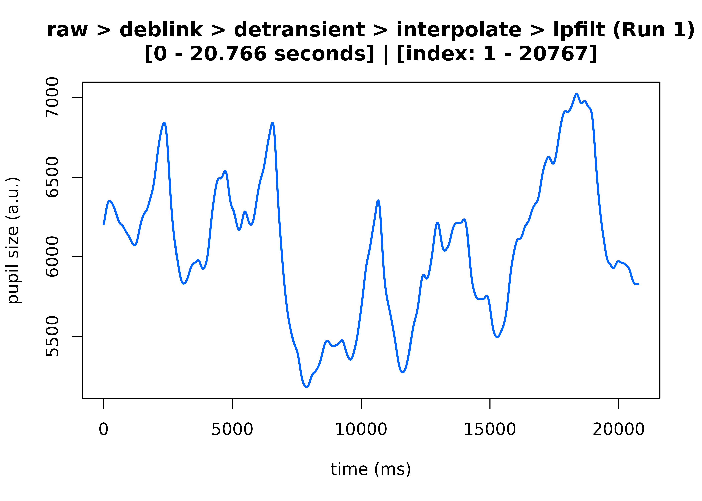
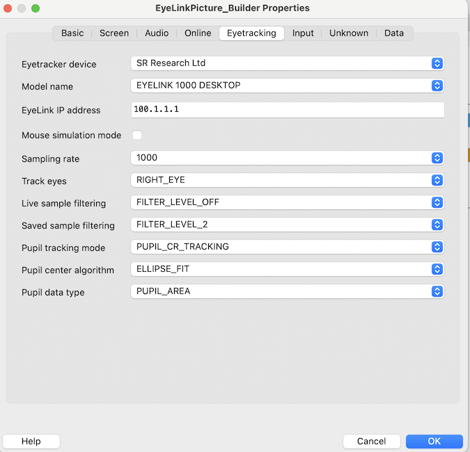

# Complete Pupillometry Pipeline Walkthrough

## 📦 Introduction

This vignette will walk you through the basics of getting started with
the `eyeris` package to preprocess your (eyelink) pupillometry data from
start to finish. Here, we’ll walk through loading in the raw data,
preprocessing, and quality control in a step-by-step manner.

We will specifically focus on demonstrating the
[`eyeris::glassbox()`](https://eyeris.shawnschwartz.com/reference/glassbox.md)
function, which we built to streamline, in part, the process of
collecting and preprocessing any freshly collected **raw** pupillometry
dataset within minutes to assess the quality of those data while
simultaneously running a full preprocessing pipeline in *1-to-2-ish*
lines of code.

## 🔎 The Glass Box Function

Our `glassbox` function – in contrast to a “black box” function where
you run it and obtain a result with little-to-no idea as to how you got
from raw input to cleaned output – provides a highly opinionated
prescription of steps and starting parameters we (computational
neuroscientists and signal processing experts at the Stanford Memory
Lab) strongly believe any pupillometry researcher should use as their
default starting point when preprocessing any set of pupillometry data.

**We recommend starting out with the `glassbox` function to (ideally)
reduce the** **probability of accidental mishaps when “reimplementing”
the individual steps** **that make up the preprocessing pipeline both
within *and* across projects.**

Moreover, the `glassbox` function provides an “interactive” framework
where you can evaluate the consequences of the parameters used within
each step on your data in real time, therefore facilitating a fairly
easy-to-use workflow for parameter optimization on your particular
dataset.

In essence, this *interactive* process takes each opinionated step and
allows you to see both pre and post timeseries plots so you can adjust
parameters stepwise until you are satisfied with your choices (and their
consequences on your pupil timeseries data).

### Installing `eyeris`

If you haven’t already installed the `eyeris` package:

``` r

# Install latest stable release from CRAN
# install.packages("eyeris")

# pak
# install.packages("pak")
# pak::pak("shawntz/eyeris")

# Or install the development version from GitHub
# install.packages("devtools")
# devtools::install_github("shawntz/eyeris")
```

### Loading `eyeris` Package

``` r

library(eyeris)
#> 
#> eyeris v3.2.0.9000 - Lumpy Space Princess ꒰•ᴗ•｡꒱۶
#> Welcome! Type ?`eyeris` to get started.
```

### Loading Your Raw Data

#### Using the Demo Dataset

For this demo, we’ll use our built in demo dataset, which contains a
handful of trials from an associative memory task recorded in our lab.

``` r

demo_data <- eyelink_asc_demo_dataset()
```

#### Loading Your Own Custom Data

To load your own EyeLink pupillometry data, you need an `.asc` file
converted from your original `.edf` file using the official EyeLink
`edf2asc` command-line utility provided by SR Research.

**Expected Data Format:**

The `.asc` file should be a standard EyeLink ASCII output file
containing:

- Sample data with timestamps, gaze coordinates (x, y), and pupil size
- Event messages (e.g., `MSG` lines with trial markers, stimulus onsets)
- Recording metadata (sample rate, pupil measurement type, etc.)

**Example Code for Loading Custom Data:**

``` r

# Point to your own .asc file
my_data_path <- "/path/to/your/data/participant_01.asc"

# Load the data file
my_data <- eyeris::glassbox(my_data_path)
```

**Important Notes:**

- **File Path**: Replace `"/path/to/your/data/participant_01.asc"` with
  the actual path to your `.asc` file.

- **Block Handling**: Use `block = "auto"` (default) to automatically
  detect multiple recording segments within the same file. This is
  recommended for most use cases. See
  [`?eyeris::load_asc`](https://eyeris.shawnschwartz.com/reference/load_asc.md)
  for other options.

- **Binocular Data**: If you have binocular recordings, you can specify
  how to handle them:

  ``` r

  # Average both eyes (default)
  my_data <- eyeris::glassbox(
    my_data_path,
    load_asc = list(binocular_mode = "average")
  )

  # Use only left eye
  my_data <- eyeris::glassbox(
    my_data_path,
    load_asc = list(binocular_mode = "left")
  )

  # Use only right eye
  my_data <- eyeris::glassbox(
    my_data_path,
    load_asc = list(binocular_mode = "right")
  )

  # Process both eyes independently
  my_data <- eyeris::glassbox(
    my_data_path,
    load_asc = list(binocular_mode = "both")
  )
  ```

- **Data Quality**: Ensure your data was recorded **without** online
  filtering applied by the EyeLink Host PC. The `eyeris` pipeline
  expects raw, unfiltered data. See the [Caveats](#caveats) section
  below for more details on this critical requirement.

### Running the Fully-Automated Pipeline

Here, we use the example data along with the default prescribed
parameters and pipeline recipe:

``` r

# Run an automated pipeline with no real-time inspection of parameters
output <- eyeris::glassbox(demo_data)
#> ✔ [2026-07-03 02:19:27] [OKAY] Running eyeris::load_asc()
#> ℹ [2026-07-03 02:19:27] [INFO] Processing block: block_1
#> ✔ [2026-07-03 02:19:27] [OKAY] Running eyeris::deblink() for block_1
#> ✔ [2026-07-03 02:19:27] [OKAY] Running eyeris::detransient() for block_1
#> ✔ [2026-07-03 02:19:27] [OKAY] Running eyeris::interpolate() for block_1
#> ✔ [2026-07-03 02:19:27] [OKAY] Running eyeris::lpfilt() for block_1
```


    #> ! [2026-07-03 02:19:27] [WARN] Skipping eyeris::downsample() for block_1
    #> ! [2026-07-03 02:19:27] [WARN] Skipping eyeris::bin() for block_1
    #> ! [2026-07-03 02:19:27] [WARN] Skipping eyeris::detrend() for block_1
    #> ✔ [2026-07-03 02:19:27] [OKAY] Running eyeris::zscore() for block_1
    #> ℹ [2026-07-03 02:19:27] [INFO] Block processing summary:
    #> ℹ [2026-07-03 02:19:27] [INFO] block_1: OK (steps: 6, latest:
    #> pupil_raw_deblink_detransient_interpolate_lpfilt_z)
    #> ✔ [2026-07-03 02:19:27] [OKAY] Running eyeris::summarize_confounds()

    # Preview first and second steps of the pipeline
    plot(
      output,
      steps = c(1, 2),
      preview_window = c(0, max(output$timeseries$block_1$time_secs)),
      seed = 0
    )
    #> ℹ [2026-07-03 02:19:27] [INFO] Plotting block 1 with sampling rate 1000 Hz from
    #> possible blocks: 1



### Running the Pipeline Interactively

``` r

output <- eyeris::glassbox(demo_data, interactive_preview = TRUE, seed = 0)
```

### Overriding the Default Parameters

To override the default `glassbox` parameters directly within the
[`glassbox()`](https://eyeris.shawnschwartz.com/reference/glassbox.md)
function call, you need to pass in the appropriate parameter(s) for each
pipeline step to
[`glassbox()`](https://eyeris.shawnschwartz.com/reference/glassbox.md).

#### Example

``` r

output <- eyeris::glassbox(
  demo_data,
  interactive_preview = FALSE, # TRUE to visualize each step in real-time
  deblink = list(extend = 40),
  lpfilt = list(plot_freqz = FALSE)
)
#> ✔ [2026-07-03 02:19:32] [OKAY] Running eyeris::load_asc()
#> ℹ [2026-07-03 02:19:32] [INFO] Processing block: block_1
#> ✔ [2026-07-03 02:19:32] [OKAY] Running eyeris::deblink() for block_1
#> ✔ [2026-07-03 02:19:32] [OKAY] Running eyeris::detransient() for block_1
#> ✔ [2026-07-03 02:19:32] [OKAY] Running eyeris::interpolate() for block_1
#> ✔ [2026-07-03 02:19:32] [OKAY] Running eyeris::lpfilt() for block_1
#> ! [2026-07-03 02:19:32] [WARN] Skipping eyeris::downsample() for block_1
#> ! [2026-07-03 02:19:32] [WARN] Skipping eyeris::bin() for block_1
#> ! [2026-07-03 02:19:32] [WARN] Skipping eyeris::detrend() for block_1
#> ✔ [2026-07-03 02:19:32] [OKAY] Running eyeris::zscore() for block_1
#> ℹ [2026-07-03 02:19:32] [INFO] Block processing summary:
#> ℹ [2026-07-03 02:19:32] [INFO] block_1: OK (steps: 6, latest:
#> pupil_raw_deblink_detransient_interpolate_lpfilt_z)
#> ✔ [2026-07-03 02:19:32] [OKAY] Running eyeris::summarize_confounds()
```

##### Pipeline Steps with Overridable Parameters

1.  [`eyeris::load_asc()`](https://eyeris.shawnschwartz.com/reference/load_asc.md):
    \> `block`

2.  [`eyeris::deblink()`](https://eyeris.shawnschwartz.com/reference/deblink.md):
    \> `extend`

3.  [`eyeris::detransient()`](https://eyeris.shawnschwartz.com/reference/detransient.md):
    \> `n`, `mad_thresh`

4.  [`eyeris::lpfilt()`](https://eyeris.shawnschwartz.com/reference/lpfilt.md):
    \> `wp`, `ws`, `rp`, `rs`, `plot_freqz`

### Advanced: Building the Pipeline Manually

[`glassbox()`](https://eyeris.shawnschwartz.com/reference/glassbox.md)
is the recommended entry point, but every preprocessing function it
wraps is also exported and can be chained together directly as a
“building block.” For a **complete, deconstructed reference pipeline** —
each `eyeris` preprocessing function called in sequence, mapped
one-to-one to the default
[`glassbox()`](https://eyeris.shawnschwartz.com/reference/glassbox.md)
recipe — see the [**Building Blocks Under the
Hood**](https://eyeris.shawnschwartz.com/articles/anatomy.html#building-blocks-under-the-hood)
section of the *Anatomy of an `eyeris` Object* vignette.

## 💬 Caveats

### `Detrend` Step

Detrending is turned off by default.

> To enable detrending in the pipeline, pass `detrend = TRUE` to
> [`glassbox()`](https://eyeris.shawnschwartz.com/reference/glassbox.md).

**Note: Detrending your pupil timeseries can have unintended
consequences;** **we thus recommend that users understand the
implications of detrending – in** **addition to whether detrending is
appropriate for the research design and** **question(s) – before using
this function.**

### *I received this message… what does it mean and what should I do?*

You (hopefully) shouldn’t encounter this, but if you do, let us explain:

    ***WARNING: SOMETHING OUTRAGEOUS IS HAPPENING WITH YOUR PUPIL DATA!*** 

    The median absolute deviation (MAD) of your pupil speed is 0.
     This indicates a potential setup / hardware issue which has likely propogated 
     into your pupil recording. Most often, this is due to online filtering being 
     applied directly to your pupil data via the EyeLink Host PC.

     WE DO NOT RECOMMEND USING ANY ONLINE AUTO FILTERING DURING YOUR DATA RECORDING.

     ***ADDITIONAL INFO***
    The default setting for communicating with the EyeLink
     machine is to have filtering enabled on either live-streamed data or saved data 
     in EDF files.

    We do not want these filters because:
     (1) it is unclear how the EyeLink machine is specifying their low-pass filter,
     and (2) it conflicts with an assumption here in `eyeris::detransient()` to use 
     one-step difference to compute a threshold for detecting large jumps in pupil 
     data (suggesting blinking or other artifacts).

     ***GENERAL TIP***
     You should aim to have your data as raw as possible so you can 'cook' it fresh!

     ***WHAT TO DO NEXT***
     If you would like to continue preprocessing your current pupil data file,
     you should consider skipping the `eyeris::detransient()` step of the pipeline 
     altogether. Advanced users might consider additional testing by manually 
     passing in different `mad_thresh` override values into `eyeris::detransient()` 
     and then carefully assessing the consequences of any given override value on 
     the pupil data; however, this step is not recommended for most users.

     PLEASE CONTINUE AT YOUR OWN RISK.

Basically the default setting for communicating with an EyeLink machine
is to have filtering enabled on either live-streamed data or saved data
in EDF files. You **do not** want these filters because

1.  it’s unclear what are their low-pass filter specifications, and
2.  it conflicts with an assumption in
    [`eyeris::detransient()`](https://eyeris.shawnschwartz.com/reference/detransient.md)
    to use one-step difference to compute a threshold for detecting
    large jumps in pupil data (suggesting blinking or other artifacts).

> In general, you’d like to have your data as raw as possible so you can
> “cook” it fresh.

**So, if your data aren’t as raw as possible, you will need to run
`eyeris` without the `detransient` step.**

> To skip the `detransient` step, pass `detransient = FALSE` into your
> [`glassbox()`](https://eyeris.shawnschwartz.com/reference/glassbox.md)
> call.

To skip the `detransient` step within the `glassbox` pipeline, pass
`detrend = TRUE` to
[`glassbox()`](https://eyeris.shawnschwartz.com/reference/glassbox.md).

#### Some additional notes about preventing live filtering in future recordings…

Unfortunately the `Live Sample Filter` and `Saved Sample Filter` are two
common settings when experiment software communicates with EyeLink. For
example, `PsychoPy` incorporates them in the eyetracking setting panel,
and if you use `pylink` directly, these two settings are also included
in their example script / function used to connect to EyeLink. The same
goes for `Eprime` and `NBS Presentation`, where these two filter
settings are users’ responsibilities to set.

Adjusting the `config.ini` file on your EyeLink host PC to set the
defaults to be `OFF` is not sufficient as they will get overwritten when
experiment software (`PsychoPy`, `Eprime`, `NBS Presentation`, etc.)
make the initial connect request.

Therefore, unfortunately all users for all future experiments need to be
cognizant of this setting. This is why
[`eyeris::detransient()`](https://eyeris.shawnschwartz.com/reference/detransient.md)
will yell the long warning message at you (as a reminder to turn off
hardware filters).

So moving forward, please consider taking the following recommendations
into consideration:

- Use `pylink` directly, add additional optional settings beyond what
  the SR Research example scripts set so you ping down all the optional
  settings. In terms of the filter settings, it boils down to calling
  `pylink.EyeLink.setHeuristicLinkAndFileFilter()`, but there are other
  settings that you likely want to hard-code into your experiments.

- Use `pylink` directly, but don’t code additional optional settings
  into you scripts. Instead, you must manually inspect the settings on
  the console screen of host PC **at the start of each experiment** to
  make sure they are set correctly. Specifically, in terms of the filter
  settings, you just need to make sure both `Online` and
  `Saved Sample Filtering` are set to `OFF` on the EyeLink setup screen.
  *It’s on the left column along with the button to auto-threshold and
  toggle which eye to track.* **This applies to all the other optional
  settings too.**

- Use the `builder` and `ioHub` directly, and set these settings in the
  eyetracking setting panel, which saves to each experiment, so you
  don’t need to worry about it. Specifically, in terms of the filter
  settings, you should set `FILTER_LEVEL_OFF` for both **live** and
  **saved sample filtering**. You can see all the different optional
  settings here:
  <https://github.com/mh105/psychopy-eyetracker-sr-research/blob/main/psychopy_eyetracker_sr_research/sr_research/eyelink/eyetracker.py>.

- **For most users**, we simply recommend using the `PsychoPy` builder
  for `PsychoPy` experiments and use the
  `psychopy-eyetracker-sr-research` plug-in maintained by the `PsychoPy`
  development team + [Alex He, Ph.D.](https://github.com/mh105),
  Stanford Postdoctoral Scholar in the Purdon lab under the Department
  of Anesthesiology and in the Wagner lab under the Department of
  Psychology, and *co-author of* `eyeris`.



------------------------------------------------------------------------

## 📚 Citing `eyeris`

If you use the `eyeris` package in your research, please cite it!

Run the following in R to get the citation:

``` r

citation("eyeris")
#> To cite package 'eyeris' in publications use:
#> 
#>   Schwartz ST, Yang H, Xue AM, He M (2025). "eyeris: A flexible,
#>   extensible, and reproducible pupillometry preprocessing framework in
#>   R." _bioRxiv_, 1-37. doi:10.1101/2025.06.01.657312
#>   <https://doi.org/10.1101/2025.06.01.657312>.
#> 
#> A BibTeX entry for LaTeX users is
#> 
#>   @Article{,
#>     title = {eyeris: A flexible, extensible, and reproducible pupillometry preprocessing framework in R},
#>     author = {Shawn T Schwartz and Haopei Yang and Alice M Xue and Mingjian He},
#>     journal = {bioRxiv},
#>     year = {2025},
#>     pages = {1--37},
#>     doi = {10.1101/2025.06.01.657312},
#>   }
```
